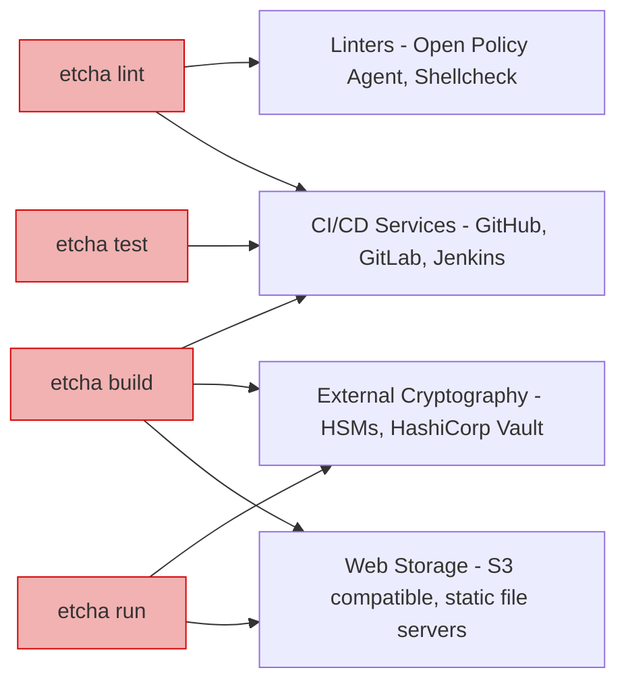

---
categories:
  - feature
description: Etcha integrates with your existing processes and tooling.
title: Bring Your Own Tools
type: docs
---

Etcha is designed to integrate with your existing tooling and processes:

- Deploy Etcha builds from any HTTP/HTTPS endpoint, like S3 or an artifact registry
- Run Etcha build, lint, and test from your favorite CI/CD pipeline, like GitHub or GitLab
- Bring your own linters to check the commands Etcha will run, such as Open Policy Agent (OPA) or Shellcheck.
- Sign and verify Etcha builds using external key providers, like HashiCorp Vault or an HSM
