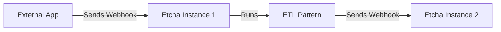

---
categories:
  - feature
description: Etcha can run commands based on webhooks and events.
title: Webhook and Event Triggers
type: docs
---

Etcha can run configurations based on the result of a push or pull.  It can also run configurations when events fire from within Etcha as well as from customizable webhook paths.

- Rapidly build ETL pipelines triggered by events and webhooks
- Create simple event driven applications and scripts
- Expose system sockets and other local, non-HTTP services
