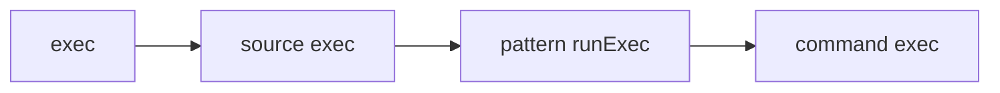

---
categories:
- reference
description: Reference documentation for Etcha's configuration
title: Config
---

{}

## Configuration Values

{}

String, a domain suffix to append to all [`targets`](#targets) for hostname resolution.

**Default:** `""`

{}

Number, worker threads to use for pushing Patterns to targets.

**Default:** Number of CPUs

{}

{}
This requires an [Unlimited License]()
{}

List of [Commands]() to run when signing a JWT instead of using a [`signingKey`](#build_signingKey).  See [Building Patterns]() for more information.

**Default:** `[]`

{}

[Exec](#exec) configuration for running [`signingCommands`](#build_signingCommands).

**Default:** `{}`

{}

String, the [cryptographic signing key]() to use when signing JWTs.  See [Building Patterns]() for more information.

**Default:** `""`

{}

String, a path to a [cryptographic signing key]() to use when signing JWTs.  See [Building Patterns]() for more information.  If specified as just a filename, Etcha will ascend directories until it finds a matching filename.  Can be used to provide [keys used with Rot](https://rotx.dev).

**Default:** `""`

{}

{}

The main `exec` configuration.  Can be overridden by other configurations.  The format for all `exec` configurations is below.  The defaults for the main `exec` are:

```json
{
  "allowOverride": true,
  "command": "/usr/bin/bash -e -o pipefail -c",
}
```

{}

Boolean, enables this Exec environment to be overridden by other Exec configurations.  Exec overrides may be deeply nested, like this:



Every exec in the path needs to allow overrides for command exec to be allowed.


**Default:** `false`

{}

String, the command to run before any [Commands]().  If this is specified, other commands will be added after it.  You'd typically put a shell interpreter in here, like `/usr/bin/bash -c`.

**Default:** `""`

{}

String, override the container entrypoint for the [`containerImage`](#exec_containerImage).

**Default:** `""`

{}

String, the container image to use.  If specified, [`command`](#exec_command), [`env`](#exec_env), and [`workDir`](#exec_workDir) will be passed/ran in a container.

**Default:** `""`

{}

String, the container network to use.  Defaults to the default network for the container runtime.

**Default:** `""`

{}

Boolean, run the container as a privileged container.

**Default:** `false`

{}

String, the container pull policy.

**Default:** `""`

{}

String, the container user or UID.

**Default:** `""`

{}

List of strings, the volumes to map into the container.

**Default:** `[]`

{}

String, override the WorkDir of a container.

**Default:** `""`

{}

Map of strings in the format `"ENVIRONMENT": "value"`, will set these as environment variables.  During override, keys will be merged with parent `exec` values, overwriting any existing ones that are defined.

**Default:** `{}`

{}

Boolean, whether to inherit the environment of the main Etcha process.

**Default:** `false`

{}

String, the group or GID to run the commands with.  Using this is typically privileged and requires root or extra capabilities.

**Default:** `""`

{}

Bool, will check if user is root and run the Commands using `sudo -E` if the user is not root.

**Default:** `false`

{}

String, the user or UID to run the commands with.  Using this is typically privileged and requires root or extra capabilities.

**Default:** `""`

{}

String, the working directory to execute commands within.

**Default:** `""`

{}

{}

{}

{}

{}

String, a regexp of files to exclude from linting.

**Default:** `"etcha.jsonnet"`

{}

A map of strings and [Exec](#exec) configurations for linters.  These linters are ran using {}.  See [Linting Patterns]() for more information.

**Default:**
```json
{
  "shellcheck": {
    "command": "-s bash -e 2154 -",
    "containerImage": "koalaman/shellcheck"
  }
}
```

{}

List of strings representing JWT property filters that must be present for a JWT to accepted.  This setting applies to all JWTs that Etcha parses.

The filter format is a list of comma separated filters.  Within the list, filters are OR, within a comma separated string, filters are AND:

```json
{
  "run": {
    "jwtFilters": [
      "aud=^a$,sub",
      "aud=^b",
    ],
  }
}
```

In this example, the JWT must match one of these conditions:

- Contain the property `aud` with a value that starts with `a`, and contain the property `sub` with any value.
- Contain the property `aud` with a value that starts with `b`.

**Default:** `[]`

{}

Number, the maximum seconds to delay starting Etcha in listen mode.  A random number between 0 and this number will be chosen, and Etcha will wait to start listening for that amount of time.  Used to prevent thundering herds and accidental concurrent configuration applies.

**Default:** `0`

{}

String, the maximum duration until a shell session is ended.  {}

**Default:** `"10m"`

{}

String, path to a writeable directory where Etcha can store patterns for future diffing.  Used during {}.  Defaults to current working directory if unset.

**Default:** `""`

{}

String, the secret to protect `/etcha/v1/system/metrics` endpoint during {}.  Setting this value enables the metrics endpoint.  See [Monitoring]() for more information.

**Default:** `""`

{}

{}
This requires an [Unlimited License]()
{}

List of [Commands]() to run when verifying a JWT instead of using [`verifyKeys`](#run_verifyKeys).  See [Running Patterns]() for more information.

**Default:** `[]`

{}

[Exec](#exec) configuration for running [`verifyCommands`](#run_verifycommands).

**Default:** `{}`

{}

List of [cryptographic verify keys]() to use when verifying JWTs.  See [Running Patterns]() for more information.

**Default:** `[]`

{}

Sources is a map of source names to source configurations.  See [Running Patterns]() for more information.

**Default:** `{}`

### `sources_[source]_allowPush` {#sources_allowPush}

Boolean, allow a source to receive patterns via push.

**Default:** `false`

### `sources_[source]_checkOnly` {#sources_checkOnly}

Boolean, prevents patterns received on this source from running change commands.

**Default:** `false`

### `sources_[source]_commands` {#sources_commands}

List of static [Commands]() to run for this source.  If allowed, Pattern pushes and pulls will override the list of Commands.  Commands will use the source's `exec` config, if allowed by the main `exec` config.  Commands will be ran at startup unless `triggerOnly` is set to true.  See [Running Commands]() for more information.

### `sources_[source]_eventsReceive` {#sources_eventsReceive}

List of event names that the source patterns can receive.

**Default:** `[]`

### `sources_[source]_eventsSend` {#sources_eventsSend}

String, a regular expression to match event names that the source patterns can send.  Can specify `".*"` to allow everything.

**Default:** `""`

### `sources_[source]_exec` {#sources_exec}

[Exec](#exec) configuration for the source.

**Default:** `{}`

### `sources_[source]_jwtFilters` {#sources_jwtFilters}

[run_jwtFilters](#run_jwtFIlters) configuration for the source.  Will replace global `run_jwtFilters` for this source.

**Default:** `[]`

### `sources_[source]_noRemove` {#sources_noRemove}

Boolean, never remove [Commands]() for a [Pattern]() [source](#sources) when diffing.

**Default:** `false`

### `sources_[source]_noRestore` {#sources_noRestore}

Boolean, prevents Etcha from saving/restoring the JWTs for this `source`.  Useful for preventing `push-commands` from re-running at startup.

### `sources_[source]_pullIgnoreVersion` {#sources_pullIgnoreVersion}

Boolean, don't consider `etchaVersion` property differences in [JWTs]() to require a new pull.

**Default:** `false`

### `sources_[source]_pullPaths` {#sources_pullPaths}

List of paths to pull JWTs from for this source.  Can be local disk paths or http/https paths.  For http/https paths, HTTP headers can be specified by appending `#header:value` and separating headers using `\r\n`, e.g. `#header1:value1\r\nheader2:value2`.  A special header, `skipVerify`, can also be added to ignore certificate verification errors.

See [Running Patterns]() for more information.

**Default:** `[]`

### `sources_[source]_runFrequency` {#sources_runFrequency}

String, duration between (optionally pulling) and running the source pattern.  Setting this to "" means the source will never be pulled/ran except at startup.  {}

**Default:** `""`

### `sources_[source]_runMulti` {#sources_runMulti}

Boolean, allows for multiple runs to of the source to happen at the same time.  By default, multiple runs will queue.  Some scenarios where this might occur include repeated pushes, or pulls with too low of a [`runFrequencySec`](#sources_runfrequencysec).  Use with caution.

**Default:** `false`

### `sources_[source]_shell` {#sources_shell}

[Exec](#exec) configuration for starting a shell via {}.  Setting the `command` value will enable shell access.

**Default:** `""`

### `sources_[source]_triggerOnly` {#sources_triggerOnly}

Boolean, when `true`, never run a Pattern unless it's triggered via [Events or Webhooks]().

**Default:** `false`

### `sources_[source]_verifyCommands` {#sources_verifyCommands}

{}
This requires an [Unlimited License]()
{}

See [Run > verifyCommands](#run_verifyCommands).  Setting this value overrides `run.verifyCommands`.

**Default:** `[]`

### `sources_[source]_verifyExec` {#sources_verifyExec}

See [Run > verifyExec](#run_verifyExec).  Setting this value overrides `run.verifyExec` if `run.verifyExec` allows overrides.

**Default:** `{}`

### `sources_[source]_verifyKeys` {#sources_verifyKeys}

See [Run > verifyKeys](#run_verifyKeys).  Setting this value appends it to `run.verifyKeys`.

**Default:** `[]`

### `sources_[source]_webhookPaths` {#sources_webhookPaths}

List of HTTP paths to listen for webhooks.  See [Running Patterns]() for more information.

**Default:** `[]`

### `sources_[source]_vars` {#sources_vars}

A map of Source-specific [`vars`](#vars).

**Default:** `{}`

{}

A map of target names to target options for use by {} and {}:

```json
{
  "targets": {
    "server1": {
      "hostname": "server1.example.com",
      "insecure": true,
      "port": 4001,
      "sources": [
        "core",
        "nginx"
      ],
      "vars": {
        "selinux": true
      }
    }
  }
}
```

See [Running Patterns]() for more information.

Targets are meant to be flexible **and proxyable**.  Etcha uses standard HTTP/HTTP2 functionality, including Server-Sent Events (SSE) for shell access, and it should work out of the box with most reverse proxies (NGINX, Traefik, HAProxy, etc).  You could have all of your Etcha devices behind a proxy and use separate paths (`/server1/etcha/v1/push`) or host-based routing on your proxy.  This would be the Etcha equivalent of a jumpbox.

### `targets_[target]_hostname` {#targets_hostname}

String, the hostname or IP address of the target (default: the target name).

**Default:** The target name

### `targets_[target]_insecure` {#targets_insecure}

Boolean, will use an insecure (not HTTPS) connection when connecting to the target.

**Default:** `false`

### `targets_[target]_pathPush` {#targets_pathPush}

String, the URL path for the push endpoint without any sources.

**Default:** `"/etcha/v1/push"`

### `targets_[target]_pathShell` {#targets_pathShell}

String, the URL path for the shell endpoint without any sources.

**Default:** `"/etcha/v1/shell"`

### `targets_[target]_port` {#targets_port}

String, the port number of the target.

**Default:** `"4000"`

### `targets_[target]_sourcePatterns` {#targets_sourcePatterns}

A map of source names to Pattern paths or Commands.  Etcha will push to this target if the source is specified with `etcha push`.  If the Pattern is an empty string, Etcha will allow any Pattern or Command to be pushed if the Source is matched.

**Default:** `{}`

### `targets_[target]_vars` {#targets_vars}

A map of Target-specific [`vars`](#vars).

**Default:** `false`

{}

A map of strings and any type of value.  Can be used during rendering to get/set values.  See [Patterns - Variables](), [Building Patterns](), and [Running Patterns]() for more information.

Vars are combined in this order:

- [Pattern `etchaRunVars`]()
- Top level `vars` (this value)
- [Source `vars`](#sourcevars)
- [Target `vars` (push only)](#targetvars)

Vars can be retrieved in Patterns using [`getConfig`]().

**Default:** `{}`

The following `vars` are added to all Patterns:

#### `source`

String, the source name of the Pattern.

#### `sysinfo`

Map of values containing useful system information:

- `containerEngine`: String, the detected container engine (docker or podman)
- `cpuLogical`: Number, count of logical CPUs
- `defaultInterface`: String, the interface name used by the default route
- `fqdn`: String, the FQDN of the machine
- `hostname`: String, the short hostname of the machine
- `interfaces`: Map of interface details
- `ipv4`: List of IPv4 addresses in CIDR format (`1.1.1.1/24`)
- `ipv6`: List of IPv6 addresses in CIDR format (`::1/64`)
- `mac`: String, MAC address of interfaces
- `kernelRelease`: String, the kernel release name (`uname -r`)
- `kernelVersion`: String, the kernel version (`uname -v`)
- `machine`: String, the machine version, (like `x86_64`)
- `memoryTotal`: Number, total system memory in MB
- `osID`: String, the `ID` of the OS (`debian`)
- `osIDLike`: String, the `ID _LIKE` of the OS (`debian`)
- `osName`: String, the `NAME` of the OS (`Ubuntu`)
- `osType`: String, type of OS (`linux`)
- `osVersion`: String, the `VERSION` of the OS (`24.04 LTS (Noble Numbat)`)
- `osVersionCodename`: String, the `VERSION_CODENAME` of the OS (`bookworm`)
- `osVersionID`: String, the `VERSION_CODENAME` of the OS (`12`)
- `packageManager`: String, the package manager in use (`apt`)
- `runtimeArch`: String, architecture of the Etcha binary (`amd64`)

#### `test`

Boolean, will be `true` if a Pattern is in [test mode]().


#### Build Vars

During a Pattern [`build`](), the following additional `vars` will be set:

- `srcDir`: String, the directory of the Pattern being built.
- `srcPath`: String, the path of the Pattern being built.

#### Push Vars

During a Pattern [`push`](), the following additional `vars` will be set:

- `source`: String, the source name that was pushed.
- `target`: String, the target name that is being pushed to.

#### Run Vars

During a Pattern [`run`](), the following additional `vars` will be set:

- `jwt`: String, the contents of the original JWT if the Pattern was run from a JWT.
