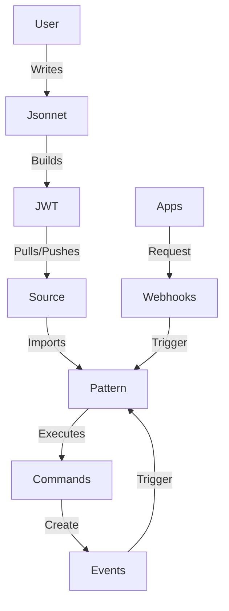

---
categories:
- explanations
description: Level set understanding of Etcha and how it works.
title: Architecture
---

Etcha is a tool that runs **Patterns**: imperative build and runtime configurations and scripts, written in Jsonnet.

## Patterns and Commands

A Pattern looks something like this:

```json
{
  "build": [
    {
      "always": true,
      "change": "make myapp",
      "id": "build myapp"
    }
  ],
  "run": [
    {
      "change": "curl -L https://s3.example.com/myapp_v2 -o /myapp",
      "check": "myapp --version | grep v2",
      "id": "copy myapp v2",
      "onChange": [
        "restart myapp"
      ]
    },
    {
      "change": "systemctl restart myapp",
      "id": "restart myapp"
    }
  ]
}
```

In this example, the Pattern contains build and run **Commands**.  Commands are an imperative list of **change**, **check**, and **remove** scripts:

- **check** will always run, and is used to check if a command needs to be changed.
- **change** will only run under certain conditions, like if check fails.
- **remove** will only run if the command is removed in future Patterns or the `change` value is modified.

In the example above, the build configuration will always run the `change`, `make myapp`.  The run configuration will run the first Command's `check`, and if that doesn't exit 0, it will run the `change`.  If the `change` is run, it will also cause the command `restart myapp` to run its `change`, too, since it triggered it via `onChange`.

{}
The tool that Etcha replaced at Candid involved a lot of conditionals--if this, then that, etc.  This became a debugging nightmare, and we wanted an easier way of triggering things without carrying variables around.
{}


## Jsonnet

Writing JSON is terrible, so instead we write Patterns using **Jsonnet**:

```
local app_name = 'myapp';
local restart = function(name)
  {
    change: 'systemctl restart %s' % name,
    id: 'restart %s' % name,
  };

{
  build: [
    {
      always: true,
      change: 'make %s' % app_name,
      id: 'build %s' % app_name,
    },
  ],
  run: [
    {
      change: 'curl -L https://s3.example.com/myapp_v2 -o /myapp',
      check: "myapp --version | grep v2",
      id: "copy %s v2' app_name,
      onChange: [
        'restart myapp',
      ],
    },
    restart(app_name),
  ]
}
```

With Jsonnet, we can use real programming language features like functions, variables, and imports to describe Patterns and Commands succinctly.  Additionally, we can do neat things like lint our Patterns, Commands, and other libraries.

{}
Jsonnet may seem foreign but it's really easy to use, especially if you're coming from a YAML background.  Etcha can help with linting, and there are Jsonnet language servers available for your editor.
{}

## Building JWTs

Etcha builds Patterns into cryptographically signed files called **JSON Web Tokens (JWTs)**.  These files contain the raw Pattern Jsonnet files, allowing us to render the Patterns on each node.

Building a JWT will cause Etcha to run the `build` configurations as part of the build process.  In the above example, running `etcha build example.jsonnet` will also run `make myapp`.

{}
A lot of Infrastructure-as-Code solutions kind of dance around the idea of a "release artifact"--something that was a deployed as kind of a point-in-time snapshot.  In Etcha, these JWTs are those release artifacts.  They can be stored in artifact registries and deployed like any other release artifact.
{}

## Sources

Once we have built our JWT, which contains our Patterns, we configure our Etcha instances to **Push** or **Pull** the JWT.  This is done through **Sources** in the remote Etcha's configuration file.

- **If a source is configured to allow pushes**, the local Etcha instance can connect to a remote Etcha instance and pushes the JWT.

- **If a source is configured to pull**, the remote Etcha instance pulls down a JWT from its local disk, or a web server/object storage location.

In either mode, Etcha will verify the JWT signature and ensure its valid, render the Pattern, and execute the `run` configuration.

## Events and Webhooks

Sources can be configured to listen for **Events** and **Webhooks**:

- **Events** are fired by Patterns using the `onChange` property.  Etcha also uses Events to extract data from your Patterns.

- **Webhooks** are paths configured by a Source.  Etcha will run a Source's Pattern for each Webhook request, and set environment variables containing details about the request.

## Putting It All Together

This diagram should make sense now:


