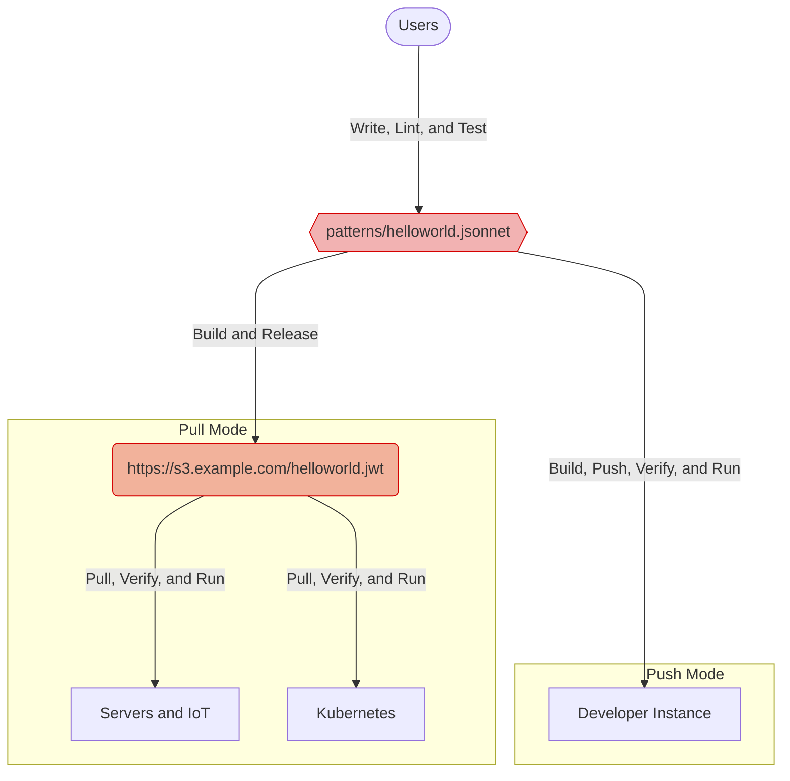

{}
<h1>Infinite Scale Configuration Management For Distributed Platforms</h1>
<h2>Etcha creates serverless build and runtime configurations for your servers and apps.</h2>

```mermaid
flowchart TD
  style helloworld fill:#d50000,fill-opacity:0.3,stroke:#d50000
  style storage fill:#d50000,fill-opacity:0.3,stroke:#d50000

  helloworld{{patterns/helloworld.jsonnet}}
  user([Users])

  subgraph Pull Mode&nbsp&nbsp&nbsp&nbsp&nbsp&nbsp&nbsp&nbsp&nbsp&nbsp&nbsp&nbsp&nbsp&nbsp&nbsp&nbsp&nbsp&nbsp
    storage(https://s3.example.com/helloworld.jwt)
    servers[Servers and IoT]
    kubernetes["Kubernetes"]
  end

  subgraph &nbsp&nbsp&nbsp&nbsp&nbsp&nbsp&nbsp&nbsp&nbsp&nbsp&nbsp&nbsp&nbsp&nbsp&nbsp&nbsp&nbsp&nbsp&nbspPush Mode
    instance[Developer Instance]
  end

  user -- Write, Lint, and Test ----> helloworld
  helloworld -- Build and Release ----> storage
  storage -- Pull, Verify, and Run ----> servers
  storage -- Pull, Verify, and Run ----> kubernetes
  helloworld -- Build, Push, Verify, and Run -------> instance
```

{}
