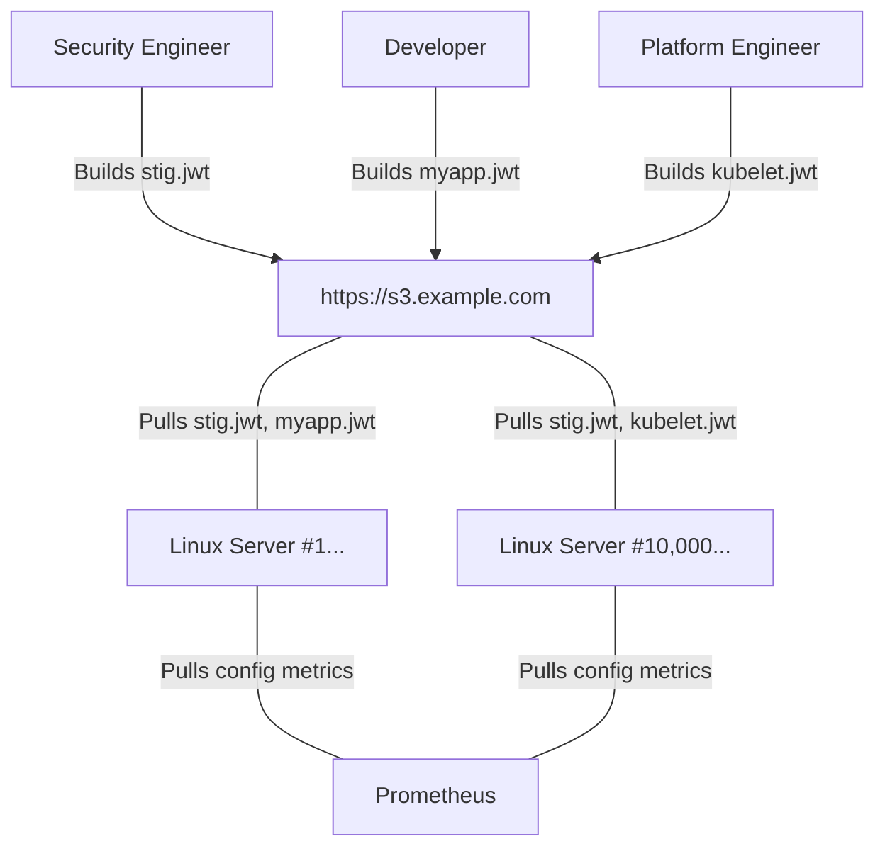

---
categories:
  - feature
description: Etcha can infinitely scale your configuration delivery.
title: Infinite Scale
type: docs
---

Etcha builds configurations into portable, signed files you can distribute from anywhere.

- Serve your configurations from a service like S3 to handle millions (or more) of clients.  It's just a text file!
- Etcha exposes metrics for services like Prometheus to monitor the distribution of configurations
- Configurations are rendered locally and rapidly applied
