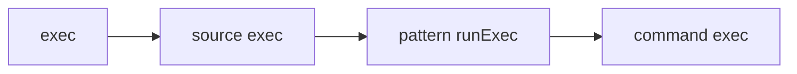

---
categories:
- reference
description: Reference documentation for Etcha's configuration
title: Config
---

Etcha can be configured using JSON/Jsonnet configuration files, environment variables, and [command line arguments]().  Configurations from one source will override previous sources, i.e. environment variables override configuration files, command line arguments override environment variables.

The configuration is divided into these sections:

- <a href="#build">Build</a>
- <a href="#cli">App</a>
- <a href="#exec">Exec</a>
- <a href="#lint">Lint</a>
- <a href="#run">Run</a>
- <a href="#sources">Sources</a>
- <a href="#test">Test</a>
- <a href="#vars">Vars</a>

All configuration keys are camelCase.  Configuration values can be:

- **boolean** `true` or `false`
- **integer** `1`
- **list** `["a","b","c"]`
- **map** `{"key": {}}`
- **string** `"a"`

**For command line values**, every configuration key can be set using `-x <a_config_key1>="a value" -x <a_config_key2>="another value"`, i.e. `-x cli_logLevel=debug -x run_stateDir=/var/lib/etcha`.  Config values can also be set using JSON, i.e. `-x sources_test='{"allowPush": true}'`

**For environment variables**, every configuration key can be set using `ETCHA_section_key=a value`, i.e. `ETCHA_cli_logLevel=debug`

**For configuration files**, they can be formatted using JSON or Jsonnet.  Etcha will look for `etcha.jsonnet` by default, ascending the directory tree to find it.  See [the Jsonnet reference]() for more information.  **Configuration files are rendered at startup**, allowing you to use [dynamic Jsonnet functions]() to dynamically alter the config, i.e.:

```
local getRecord(type, name, fallback=null) = std.native('getRecord')(type, name, fallback);
local verifyKey = getRecord('a', 'verify.candid.dev');

{
  run: {
    verifyKeys: [
      verifyKey,
    ]
  }
}
```

You can view the rendered configuration by running [`etcha show-config`]().

## `build`

### `pushTLSSkipVerify`

Boolean, skip TLS verification when running [`etcha push`]().

**Default:** `false`

### `signingCommands` (recommended) {#signingcommands}

List of [Commands]() to run when signing a JWT instead of using a [`signingKey`](#signingKey).  See [Building Patterns]() for more information.

**Default:** `[]`

### `signingExec`

[Exec](#exec) configuration for running [`signingCommands`](#signingcommands).

**Default:** `{}`

### `signingKey` (recommended) {#signingkey}

String, the [cryptographic signing key]() to use when signing JWTs.  See [Building Patterns]() for more information.

**Default:** `""`

## `cli`

### `configPath`

String, path to the configuration file.  If a filename without a path is specified, Etcha will search parent directories for the filename and use the first one found.

**Default:** `"etcha.jsonnet"`

### `logFormat`

String, log format to use for logging: human, kv, or raw.

**Default:** `"human"`

### `logLevel`

String, log level to use for logging: none, debug, info, or error.

**Default:** `"info"`

### `noColor`

Boolean, disables colored log output.

**Default:** `false`

## `exec`

The main `exec` configuration.  Can be overridden by other configurations.  The format for all `exec` configurations is below.  The defaults for the main `exec` are:

```json
{
  "allowOverride": true,
  "command": "/usr/bin/bash -e -o pipefail -c",
}
```

### `allowOverride`

Boolean, enables this Exec environment to be overridden by other Exec configurations.  The entire Exec configuration will be overridden, no partial overrides.  Exec overrides may be deeply nested, like this:



Every exec in the path needs to allow overrides for command exec to be allowed.


**Default:** `false`

### `command`

String, the command to run before any [Commands]().  If this is specified, other commands will be added after it.  You'd typically put a shell interpreter in here, like `/usr/bin/bash -c`.

**Default:** `""`

### `containerEntrypoint`

String, override the container entrypoint for the [`containerImage`](#containerImage).

**Default:** `""`

### `containerImage`

String, the container image to use.  If specified, [`command`](#command), [`env`](#env), and [`workDir`](#workDir) will be passed/ran in a container.

**Default:** `""`

### `containerNetwork`

String, the container network to use.  Defaults to the default network for the container runtime.

**Default:** `""`

### `containerPrivileged`

Boolean, run the container as a privileged container.

**Default:** `false`

### `containerPull`

String, the container pull policy.

**Default:** `""`

### `containerUser`

String, the container user or UID.

**Default:** `""`

### `containerVolumes`

List of strings, the volumes to map into the container.

**Default:** `[]`

### `containerWorkDir`

String, override the WorkDir of a container.

**Default:** `""`

### `env`

List of strings in the format `ENVIRONMENT=value`, will set these as environment variables.

**Default:** `[]`

### `envInheirt`

Boolean, whether to inherit the environment of the main Etcha process.

**Default:** `false`

### `group`

String, the group or GID to run the commands with.  Using this is typically privileged and requires root or extra capabilities.

**Default:** `""`

### `user`

String, the user or UID to run the commands with.  Using this is typically privileged and requires root or extra capabilities.

**Default:** `""`

### `workDir`

String, the working directory to execute commands within.

**Default:** `""`

## `lint`

### `exclude`

String, a regexp of files to exclude from linting.

**Default:** `"etcha.jsonnet"`

### `linters` (recommended) {#linters}

A map of strings and [Exec](#exec) configurations for linters.  These linters are ran using [`etcha lint`]().  See [Linting Patterns]() for more information.

**Default:**
```json
{
  "shellcheck": {
    "command": "-s bash -e 2154 -",
    "containerImage": "koalaman/shellcheck"
  }
}
```


## `run`

### `listenAddress`

String, the address to listen on when running Etcha in listen mode ([`etcha run`]()).

**Default:** `":4000"`

### `randomizedStartDelaySec`

Integer, the maximum number of seconds to delay starting Etcha in listen mode.  A random number between 0 and this number will be chosen, and Etcha will wait to start listening for that amount of time.  Used to prevent thundering herds and accidental concurrent configuration applies.

**Default:** `0`

### `rateLimiterRate` (recommended) {#ratelimiterrate}

String, the maximum number of requests to allow from an IP address before rate limiting them.  Takes the format of <number>-<time interval>, where "10-M" means 10 requests/minute.  Rate limiting is applied to every HTTP request.

**Default:** `"10-M"`

### `stateDir` (recommended)

String, path to a writeable directory where Etcha can store patterns for future diffing.  Used during [etcha run]().  Defaults to current working directory if unset.

**Default:** `""`

### `systemMetricsSecret` (recommended)

String, the secret to protect `/etcha/v1/system/metrics` endpoint during [etcha run]().  Setting this value enables the metrics endpoint.  See [Monitoring]() for more information.

**Default:** `""`

### `systemPprofSecret`

String, the secret to protect `/etcha/v1/system/pprof/goroutine` and `/etcha/v1/system/pprof/heap` endpoints during [etcha run]().  Setting this value enables these endpoints.  This is mostly used for development and shouldn't be set during production use.

**Default:** `""`

### `tlsCertificateBase64` (recommended)

String, base64 encoded PEM certificate used by [etcha run]().  If this or [`tlsCertificatePath`](#tlsCertificatePath) is not specified, Etcha will generate a self-signed, in-memory certificate and key.

**Default:** `""`

### `tlsCertificatePath` (recommended)

String, path to a PEM certificate used by [etcha run]().  If this or [`tlsCertificateBase64`](#tlsCertificateBase64) is not specified, Etcha will generate a self-signed, in-memory certificate and key.

**Default:** `""`

### `tlsKeyBase64` (recommended)

String, base64 encoded PEM key used by [etcha run]().  If this or [`tlsKeyPath`](#tlsKeyPath) is not specified, Etcha will generate a self-signed, in-memory certificate and key.

**Default:** `""`

### `tlsKeyPath` (recommended)

String, path to a PEM key used by [etcha run]().  If this or [`tlsKeyBase64`](#tlsKeyBase64) is not specified, Etcha will generate a self-signed, in-memory certificate and key.

**Default:** `""`

### `verifyCommands` (recommended) {#verifycommands}

List of [Commands]() to run when verifying a JWT instead of using [`verifyKeys`](#verifyKeys).  See [Building Patterns]() for more information.

**Default:** `[]`

### `verifyExec`

[Exec](#exec) configuration for running [`verifyCommands`](#verifycommands).

**Default:** `{}`

### `verifyKeys` (recommended) {#verifykeys}

List of [cryptographic verify keys]() to use when verifying JWTs.  See [Building Patterns]() for more information.

**Default:** `[]`

## `sources`

Sources is a map of source names to source configurations.  See [Running Patterns]() for more information.

**Default:** `{}`

### `allowPush`

Boolean, allow a source to receive patterns via push.

**Default:** `false`

### `checkOnly`

Boolean, prevents patterns received on this source from running change commands.

**Default:** `false`

### `commands`

List of static [Commands]() to run for this source.  If allowed, Pattern pushes and pulls will override the list of Commands.  Commands will use the source's `exec` config, if allowed by the main `exec` config.  Commands will be ran at startup unless `triggerOnly` is set to true.  See [Running Commands]() for more information.

### `eventsReceive`

List of event names that the source patterns can receive.

**Default:** `[]`

### `eventsReceiveExit`

Boolean, will cause Etcha to exit when events are received by this source.  Should only be used for managing/updating Etcha from within Etcha.

**Default:** `false`

### `eventsSend`

String, a regular expression to match event names that the source patterns can send.  Can specify `".*"` to allow everything.

**Default:** `""`

### `exec`

[Exec](#exec) configuration for the source.

**Default:** `{}`

### `noRemove`

Boolean, never remove [Commands]() for a [Pattern]() [source](#sources) when diffing.

**Default:** `false`

### `noRestore`

Boolean, prevents Etcha from saving/restoring the JWTs for this `source`.  Useful for preventing `push-commands` from re-running at startup.

### `pullIgnoreVersion`

Boolean, don't consider `etchaVersion` property differences in [JWTs]() to require a new pull.

**Default:** `false`

### `pullPaths` (required)

List of paths to pull JWTs from for this source.  Can be local disk paths or http/https paths.  For http/https paths, HTTP headers can be specified by appending `#header:value` and separating headers using `\r\n`, e.g. `#header1:value1\r\nheader2:value2`.  A special header, `skipVerify`, can also be added to ignore certificate verification errors.

See [Running Patterns]() for more information.

**Default:** `[]`

### `runAll`

Boolean, instead of only running differences, run all [Commands]() for a [Pattern]() [source](#sources).  Commands that are not present in a new Pattern will still be removed, set [`noRemove`](#noremove) to change this behavior.

**Default:** `false`

### `runFrequencySec`

Integer, the number of seconds between pulling and running the source pattern.  Setting this to 0 means the source will never be pulled/ran except at startup.

**Default:** `0`

### `runMulti`

Boolean, allows for multiple runs to of the source to happen at the same time.  By default, multiple runs will queue.  Some scenarios where this might occur include repeated pushes, especially with [`runAll`](#runAll), or pulls with too low of a [`runFrequencySec`](#runfrequencysec).  Use with caution.

**Default:** `false`

### `triggerOnly`

Boolean, when `true`, never run a Pattern unless it's triggered via [Events or Webhooks]().

**Default:** `false`

### `verifyCommands`

See [Run > verifyCommands](#verifycommands).  Setting this value overrides `run.verifyCommands`.

**Default:** `[]`

## `vars`

A map of strings and any type of value.  Can be used during rendering to get/set values.  Will be combined with the top-level rendering--the values set here will override top-level ones.  See [Patterns - Variables](), [Building Patterns](), and [Running Patterns]() for more information.

**Default:** `{}`

### `verifyExec`

See [Run > verifyExec](#verifyexec).  Setting this value overrides `run.verifyExec` if `run.verifyExec` allows overrides.

**Default:** `{}`

### `verifyKeys`

See [Run > verifyKeys](#verifykeys).  Setting this value appends it to `run.verifyKeys`.

**Default:** `[]`

### `webhookPaths`

List of HTTP paths to listen for webhooks.  See [Running Patterns]() for more information.

**Default:** `[]`

## `vars`

A map of strings and any type of value.  Can be used during rendering to get/set values.  See [Patterns - Variables](), [Building Patterns](), and [Running Patterns]() for more information.

**Default:** `{}`

During a Pattern [`build`](), the following additional `vars` will be set: 

- `dstDir`: String, the directory of the output JWT file.
- `dstPath`: String, the path of the output JWT file.
- `srcDir`: String, the directory of the Pattern being built.
- `srcPath`: String, the path of the Pattern being built.

During a Pattern [`test`](), the following additional `vars` will be set:

- `test`: Boolean, will be `true`
